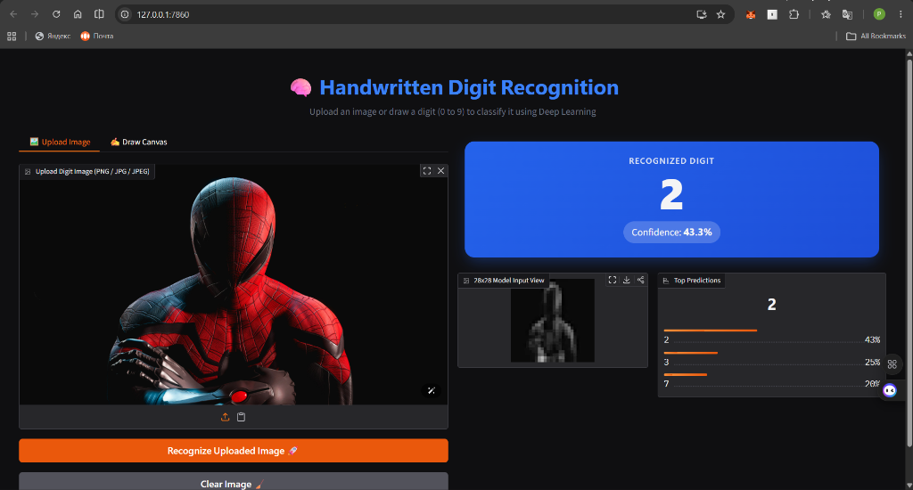
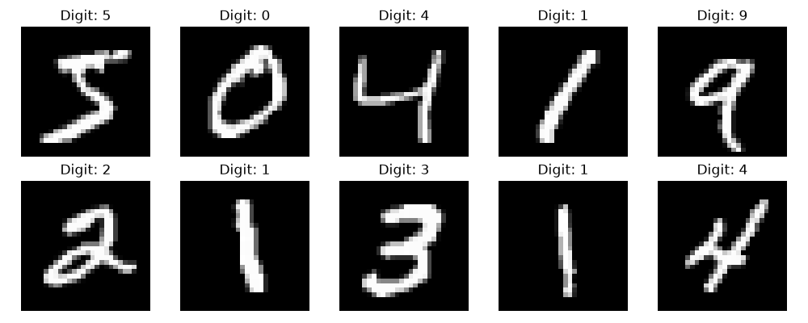
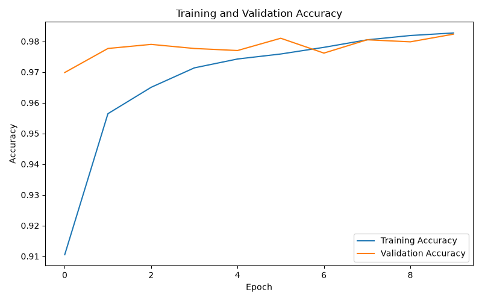
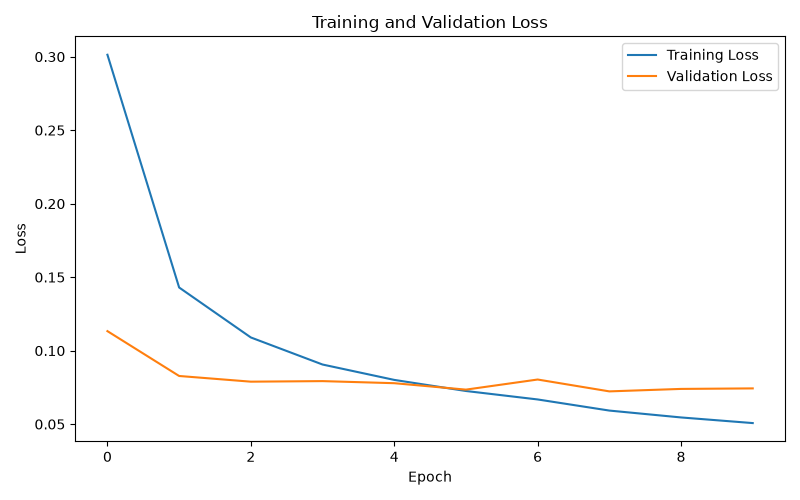
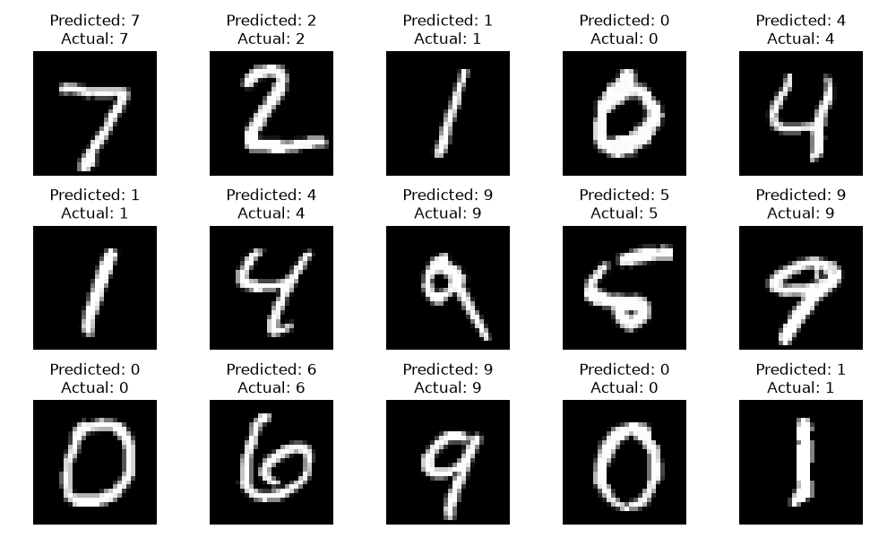
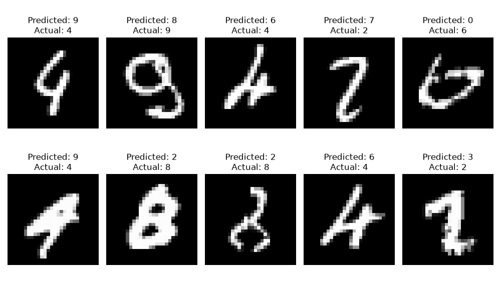

# Handwritten Digit Recognition with Deep Learning & Web App

[](LICENSE)

A full-stack Deep Learning web application built using **TensorFlow**, **NumPy**, and **Flask** to recognize handwritten digits (0 to 9) in real time with **~98% test accuracy**. Features an interactive drawing canvas, image upload support, official MNIST-style bounding-box and center-of-mass preprocessing, and an ultra-lightweight pure-NumPy inference engine deployed live on **Vercel**.

---

## Live Demo & Repository

- **Live Web App**: [https://handwritten-digit-recognition-jhzv.vercel.app](https://handwritten-digit-recognition-jhzv.vercel.app)
- **GitHub Repository**: [https://github.com/prashantsharma008/handwritten-digit-recognition](https://github.com/prashantsharma008/handwritten-digit-recognition)

---

## Web Application Preview



---

## Key Features

- **Interactive Drawing Canvas**: HTML5 canvas with adjustable brush sizes, touch support for mobile/tablets, and instant stroke drawing.
- **Image Upload Zone**: Drag-and-drop or browse digit images in PNG, JPG, or JPEG format.
- **Real-Time Classification**: Instant predictions with top confidence score and animated probability distribution bars for top 3 predictions.
- **Official MNIST Preprocessing Pipeline**:
  - Automatic background brightness inversion (supports dark-on-light and light-on-dark inputs).
  - Bounding-box detection to isolate strokes regardless of drawing size or canvas position.
  - 20×20 aspect-ratio preserved scaling with a 4-pixel border margin.
  - Mass-weighted centroid (Center of Mass) alignment to position the digit's center at (13.5, 13.5) in the 28×28 frame.
- **28×28 Model Input View**: Previews the preprocessed, centered, and normalized image that the model actually evaluates.
- **Ultra-Lightweight Production Engine**:
  - Production inference runs via pure NumPy forward pass using `model_weights.npz` (only **408 KB**).
  - Zero heavy TensorFlow C++ dependencies at runtime, reducing serverless bundle size from **1.4 GB down to ~35 MB** for instant cold starts on Vercel.
- **Modern Dark UI**: Crafted with dark theme aesthetics, orange accent action buttons, blue prediction cards, and responsive layout.

---

## Project Structure

```plaintext
handwritten-digit-recognition/
├── api/                                # Vercel serverless function package
│   ├── index.py                        # WSGI entrypoint for Vercel
│   ├── model_weights.npz               # Trained neural network weights (408 KB)
│   ├── static/                         # Bundled static assets
│   └── templates/                      # Bundled HTML template
├── public/                             # Static edge CDN assets for Vercel
│   ├── index.html                      # Root HTML page
│   └── static/                         # CSS and JS for edge delivery
├── outputs/                            # Model evaluation plots & preview images
│   ├── web_app_ui.png                  # Web application UI preview
│   ├── sample_images.png               # MNIST sample digits
│   ├── accuracy.png                    # Training & validation accuracy plot
│   ├── loss.png                        # Training & validation loss plot
│   ├── predictions.png                 # Test prediction samples
│   └── incorrect_predictions.png       # Misclassified samples analysis
├── static/                             # Frontend assets
│   ├── script.js                       # Canvas drawing, API integration & UI animations
│   └── style.css                       # Styling, dark theme & responsive layout
├── templates/
│   └── index.html                      # Application template
├── app.py                              # Flask backend application & inference logic
├── handwritten_digit_recognition.py    # Model training script on MNIST dataset
├── handwritten_digit_model.keras       # Full trained Keras neural network
├── model_weights.npz                   # Lightweight compressed weights for deployment
├── requirements.txt                    # Production dependencies (flask, numpy, pillow)
└── vercel.json                         # Vercel deployment and routing configuration
```

---

## Model Architecture

The neural network is trained on the **MNIST dataset** (60,000 training images, 10,000 testing images) normalized to `[0, 1]`:

```plaintext
Input (28 x 28)
       │
    Flatten (784 features)
       │
    Dense (128 neurons, ReLU)
       │
    Dropout (0.2)
       │
    Dense (64 neurons, ReLU)
       │
    Dense (10 neurons, Softmax)
```

- **Optimizer**: Adam
- **Loss Function**: Sparse Categorical Crossentropy
- **Epochs**: 10
- **Batch Size**: 32 (with 10% validation split)
- **Test Accuracy**: **~98%**

---

## Model Training & Evaluation Visualizations

### 1. MNIST Dataset Samples
Sample images from the MNIST dataset with their corresponding ground-truth digit labels:



### 2. Training and Validation Accuracy
Accuracy progression over 10 training epochs, reaching ~98% test accuracy:



### 3. Training and Validation Loss
Loss curve demonstrating steady convergence with minimal overfitting:



### 4. Sample Model Predictions
Predictions on test images comparing the predicted class against the actual ground truth:



### 5. Incorrect Predictions Analysis
Inspection of ambiguous or noisy test digits where the model made errors:



---

## Local Installation & Setup

### 1. Clone the Repository
```bash
git clone https://github.com/prashantsharma008/handwritten-digit-recognition.git
cd handwritten-digit-recognition
```

### 2. Install Dependencies
```bash
pip install -r requirements.txt
```

*(Optional: If you want to retrain the model locally with TensorFlow and generate new plots, install `tensorflow` and `matplotlib`: `pip install tensorflow matplotlib`)*

### 3. Run the Web Application
```bash
python app.py
```
Open your browser and navigate to:
```
http://localhost:5000
```

### 4. Retrain the Model (Optional)
```bash
python handwritten_digit_recognition.py
```
This will:
1. Train the neural network on the MNIST dataset.
2. Generate accuracy and loss plots in `outputs/`.
3. Save `handwritten_digit_model.keras`.
4. Automatically export the lightweight weights to `model_weights.npz`.

---

## Deployment on Vercel

The application is configured for deployment on **Vercel**:

- **Serverless Handler**: [`api/index.py`](api/index.py) routes requests to Flask.
- **Pure-NumPy Forward Pass**: `DigitClassifier` in [`app.py`](app.py) runs matrix multiplications ($W \cdot x + b$ with ReLU and Softmax) using `model_weights.npz` with zero heavyweight TensorFlow dependencies.
- **Bundle Size**: Only **~35 MB** (well within Vercel's 500 MB limit).
- **Static Asset Serving**: [`public/`](public/) serves the UI via Vercel's global CDN.

To deploy your own fork:
1. Import the repository into [Vercel](https://vercel.com).
2. Keep the default settings and click **Deploy**.
3. Your web app will be live with full drawing and prediction capabilities!

---

## Author

Built by **pacific**

---

## License

This project is licensed under the MIT License - see the [LICENSE](LICENSE) file for details.
